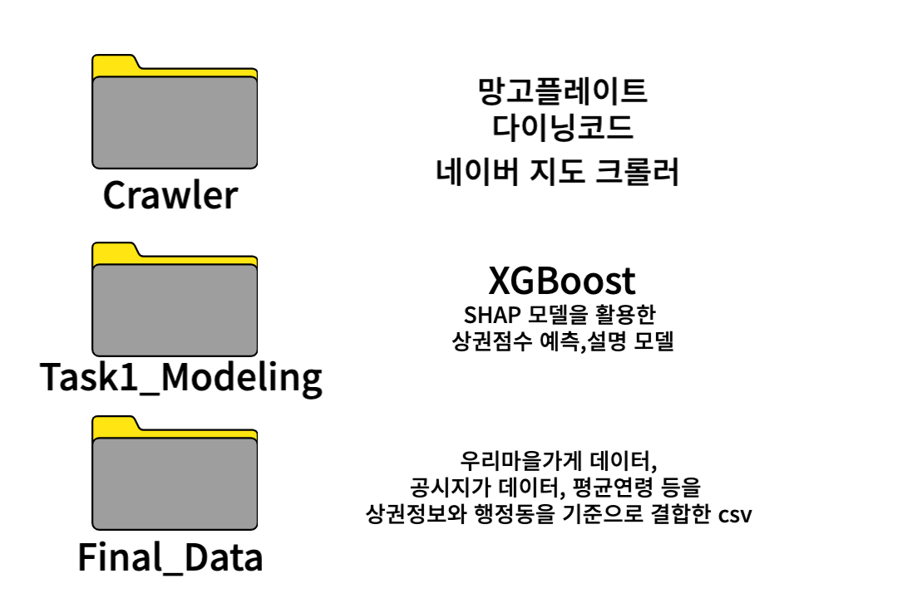
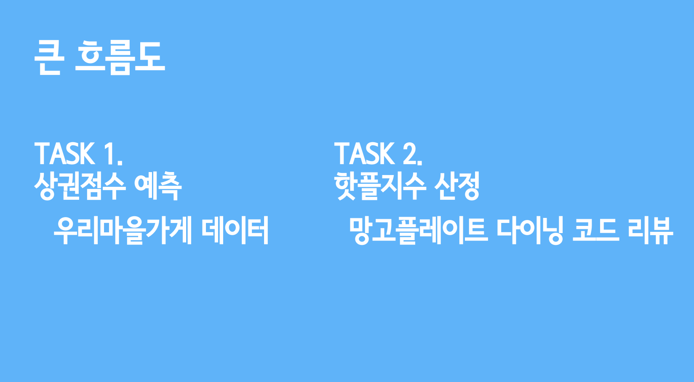
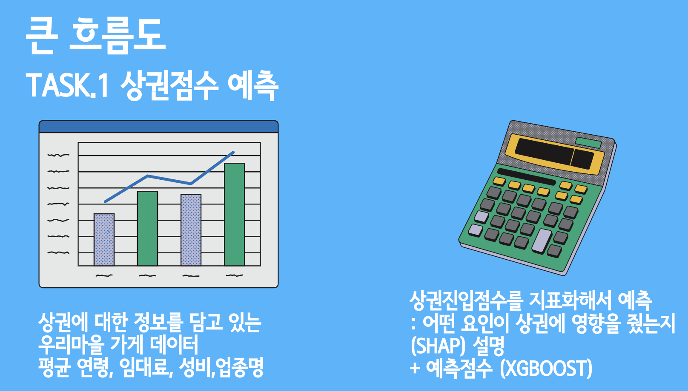
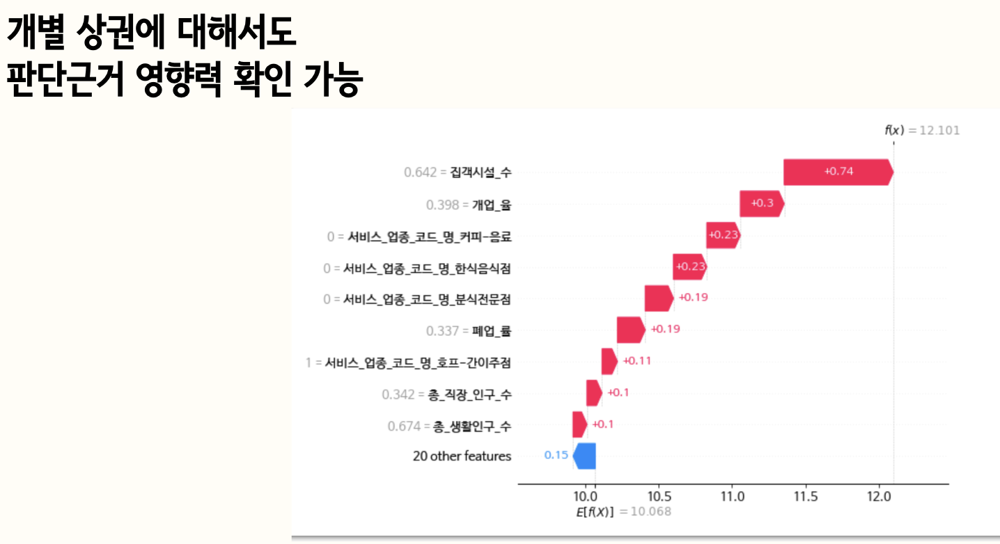
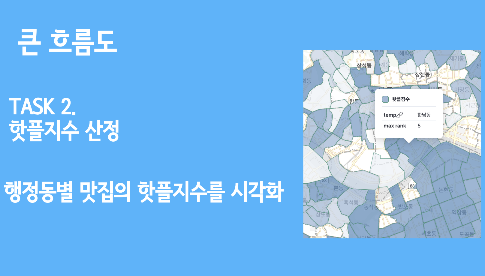
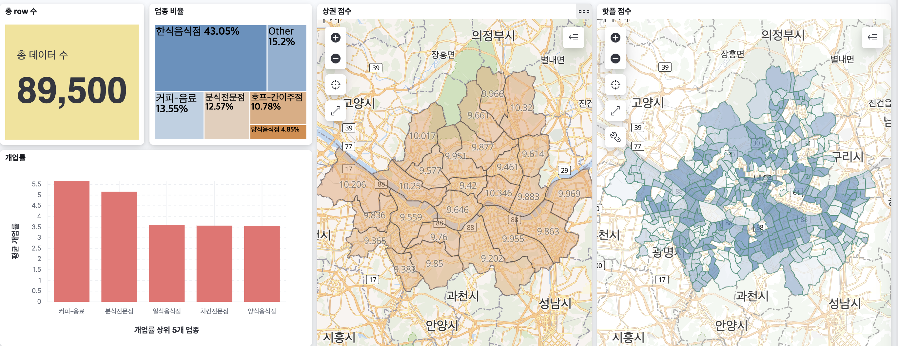

# 22th YBIGTA 신입기수 프로젝트 

## repository structure 

 

## 프로젝트의 목표는 다음과 같습니다

### 상권진입점수에 대해서 신규 진입하기 위한 모델링 지표를 도입하였습니다. 

이것을 XGBoostRegressor을 이용하여 예측합니다. 

모델링에 관한 설명은 Task1_Modeling.ipynb를 참고해주세요.

### 개별 상권에 대하여 왜 이러한 진입결과를 받았는지에 대한 설명을 샤프모델을 통하여 설명합니다.

- 핫플지수 반환

다이닝코드, 망고플레이트 지수를 합산하여 핫플지수를 대시보드에 표시합니다.

## kibana를 통해 구현한 대시보드 

